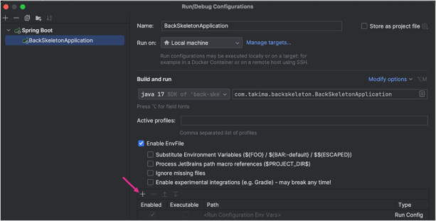
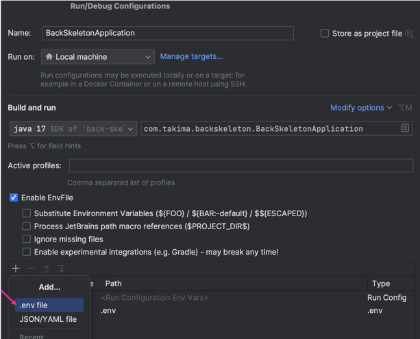
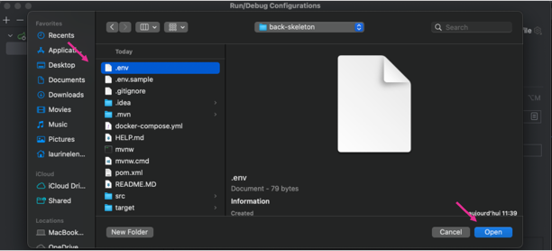

# Your backend API

## Technologies used

Java 21
Spring Boot 3.2
Spring Data JPA / Hibernate
PostgreSQL
Docker & Docker Compose


## Set up 

1. Clone the repository:
   ```bash
   git clone https://github.com/chiaracarlino/webapp_java_back.git
   cd webapp_java_back
    ```
2. Copy the environment sample file and configure your credentials: `cp .env.sample .env`
3. Fill in your .env file with your PostgreSQL credentials.
4. Start the project using Docker: `docker compose up`
5. Install the plugin : [env-file](https://plugins.jetbrains.com/plugin/7861-envfile)
6. Add your file `.env` like (Don't forget to enable hidden files)





## Start the backend manually

`mvn clean spring-boot:run`

## Access the database

`docker exec -it db-portfolio psql -U root db-portfolio`


## Data Base

User table:
| Column     | Type    | Collation | Nullable | Default                               |
| ---------- | ------- | --------- | -------- | ------------------------------------- |
| id_user    | integer |           | not null | nextval('user_id_user_seq'::regclass) |
| first_name | text    |           | not null |                                       |
| last_name  | text    |           | not null |                                       |
| email      | text    |           | not null |                                       |
| password   | text    |           | not null |                                       |

Portfolio table:
| Column         | Type    | Collation | Nullable | Default                                         |
| -------------- | ------- | --------- | -------- | ----------------------------------------------- |
| id_portfolio   | integer |           | not null | nextval('portfolio_id_portfolio_seq'::regclass) |
| name_portfolio | text    |           | not null |                                                 |
| link           | text    |           | not null |                                                 |
| linkedin       | text    |           | not null |                                                 |
| creation_date  | date    |           |          | CURRENT_DATE                                    |
| edition_date   | date    |           |          | CURRENT_DATE                                    |
| id_user        | integer |           | not null |                                                 |
| template_name  | text    |           |          |                                                 |
| json_data      | text    |           |          |                                                 |


## API Endpoints

Users
| Method | Endpoint      | Description                             | Body (JSON)                                                                    |
| ------ | ------------- | --------------------------------------- | ------------------------------------------------------------------------------ |
| POST   | `/users`      | Crée un nouvel utilisateur              | `{ "firstName": "...", "lastName": "...", "email": "...", "password": "..." }` |
| GET    | `/users`      | Récupère tous les utilisateurs          | -                                                                              |
| GET    | `/users/{id}` | Récupère un utilisateur par ID          | -                                                                              |
| PUT    | `/users/{id}` | Met à jour un utilisateur               | `{ ... }`                                                                      |
| PATCH  | `/users/{id}` | Met à jour partiellement un utilisateur | `{ ... }`                                                                      |
| DELETE | `/users/{id}` | Supprime un utilisateur                 | -                                                                              |

Portfolios
| Method | Endpoint           | Description                           | Body (JSON)                                                                              |
| ------ | ------------------ | ------------------------------------- | ---------------------------------------------------------------------------------------- |
| POST   | `/portfolios`      | Crée un portfolio                     | `{ "name": "...", "link": "...", "linkedin": "...", "templateId": 1, "jsonData": "{}" }` |
| GET    | `/portfolios`      | Récupère tous les portfolios          | -                                                                                        |
| GET    | `/portfolios/{id}` | Récupère un portfolio par ID          | -                                                                                        |
| PUT    | `/portfolios/{id}` | Met à jour un portfolio               | `{ ... }`                                                                                |
| PATCH  | `/portfolios/{id}` | Met à jour partiellement un portfolio | `{ ... }`                                                                                |
| DELETE | `/portfolios/{id}` | Supprime un portfolio                 | -                                                                                        |


## Postman

Example of json for a user:
```
{
    "idUser": 5,
    "firstName": "lulu",
    "lastName": "test",
    "email": "lulu.test@test.com",
    "password": "azerty123",
    "portfolios": []
}
```

Example of json for a portfolio:
```
{
    "idPortfolio": 6,
    "namePortfolio": "Portfolio italie",
    "link": "https://portfolio-5-portfolio-italie-1762715488455-f5xst4.com",
    "linkedin": "https://linkedin.com/in/mon-profil",
    "templateName": "classic",
    "creationDate": "2025-11-09",
    "editionDate": "2025-11-09",
    "jsonData": "{\"accueil\":{\"firstName\":\"lucille\",\"lastName\":\"finet\",\"objective\":\"stage\",\"bio\":\"je suis en majeur numérique\",\"locations\":\"italie\"},\"formation\":[{\"startDate\":\"2025-04-12\",\"endDate\":\"2026-06-28\",\"current\":true,\"degree\":\"ingenieur epf\",\"description\":\"numérique\"}],\"experience\":[{\"startDate\":\"2024-08-09\",\"endDate\":\"2024-12-29\",\"current\":false,\"jobTitle\":\"stage\",\"company\":\"esrf\",\"description\":\"\"}],\"competences\":{\"softSkills\":\"\",\"hardSkills\":\"\",\"languages\":\"\",\"certificates\":[],\"customCategories\":[]},\"contact\":{\"email\":\"\",\"phone\":\"\",\"address\":\"\",\"linkedin\":\"\",\"github\":\"\",\"twitter\":\"\"}}"
}
```


## Important Notes

- Passwords must be **at least 6 characters** long.
- Deleting a user also deletes all associated portfolios (**CASCADE**).
- The `jsonData` field in `portfolio` stores raw JSON for frontend rendering.
- Authentication can be disabled for testing purposes in `SecurityConfig.java`.
- Password encryption using BCrypt was tested but removed since this is a **local-only project**.
- Each portfolio automatically gets a unique link, but publishing is **disabled** because deployment is not implemented yet.

